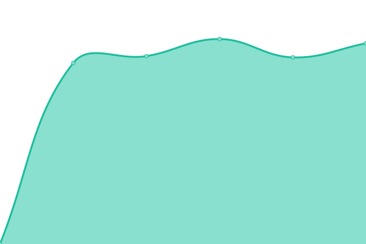
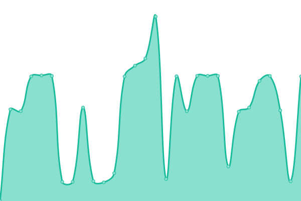

# [📈 Live Status](https://newmedia.pts.org.tw/upptime): <!--live status--> **🟧 Partial outage**

This repository contains the open-source uptime monitor and status page for [ptstaiwan](https://github.com/ptstaiwan), powered by [Upptime](https://github.com/upptime/upptime).

With [Upptime](https://upptime.js.org), you can get your own unlimited and free uptime monitor and status page, powered entirely by a GitHub repository. We use [Issues](https://github.com/ptstaiwan/upptime/issues) as incident reports, [Actions](https://github.com/ptstaiwan/upptime/actions) as uptime monitors, and [Pages](https://newmedia.pts.org.tw/upptime) for the status page.

<!--start: status pages-->
<!-- This summary is generated by Upptime (https://github.com/upptime/upptime) -->
<!-- Do not edit this manually, your changes will be overwritten -->
<!-- prettier-ignore -->
| URL | Status | History | Response Time | Uptime |
| --- | ------ | ------- | ------------- | ------ |
|  [PTS TV 公共電視](https://www.pts.org.tw/) | 🟥 Down | [pts-tv.yml](https://github.com/ptstaiwan/upptime/commits/master/history/pts-tv.yml) | 

 1969ms
     
 | 

<a href="https://ptstaiwan.github.io/upptime/history/pts-tv">99.21%</a>
    

|  [PTS PLUS 公視+](https://www.ptsplus.tv/) | 🟩 Up | [pts-plus.yml](https://github.com/ptstaiwan/upptime/commits/master/history/pts-plus.yml) | 

 413ms
     
 | 

<a href="https://ptstaiwan.github.io/upptime/history/pts-plus">100.00%</a>
    

|  [PTS NEWS 公視新聞網](https://news.pts.org.tw/) | 🟩 Up | [pts-news.yml](https://github.com/ptstaiwan/upptime/commits/master/history/pts-news.yml) | 

 1736ms
     
 | 

<a href="https://ptstaiwan.github.io/upptime/history/pts-news">100.00%</a>
    

|  [PeoPo 公民新聞](https://www.peopo.org/) | 🟩 Up | [peo-po.yml](https://github.com/ptstaiwan/upptime/commits/master/history/peo-po.yml) | 

 2073ms
     
 | 

<a href="https://ptstaiwan.github.io/upptime/history/peo-po">100.00%</a>
    

|  [PTS Friends 公視之友](https://friends.pts.org.tw/) | 🟩 Up | [pts-friends.yml](https://github.com/ptstaiwan/upptime/commits/master/history/pts-friends.yml) | 

 1265ms
     
 | 

<a href="https://ptstaiwan.github.io/upptime/history/pts-friends">100.00%</a>
    

<!--end: status pages-->

[**Visit our status website →**](https://newmedia.pts.org.tw/upptime/)

## 📄 License

- Powered by: [Upptime](https://github.com/upptime/upptime)
- Code: [MIT](./LICENSE) © [ptstaiwan](https://github.com/ptstaiwan)
- Data in the `./history` directory: [Open Database License](https://opendatacommons.org/licenses/odbl/1-0/)
