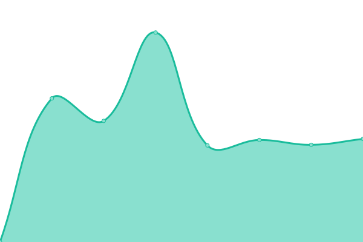

# [📈 目前狀態](https://newmedia.pts.org.tw/upptime): <!--live status--> **🟩 所有服務皆運作正常**

此開源專案為 [upptime](https://github.com/upptime/upptime) 開發，[ptstaiwan](https://github.com/ptstaiwan) 維護的網站監控服務

藉由 [Upptime](https://upptime.js.org)，你可以使用 GitHub Repository 免費且無限制的監控網站服務狀態

我們使用:

- GitHub [Issues](https://github.com/ptstaiwan/upptime/issues) 回報異常事件
- GitHub [Actions](https://github.com/ptstaiwan/upptime/actions) 自動化監控
- GitHub [Pages](https://newmedia.pts.org.tw/upptime) 產生服務狀態頁面

<!--start: status pages-->
<!-- This summary is generated by Upptime (https://github.com/upptime/upptime) -->
<!-- Do not edit this manually, your changes will be overwritten -->
<!-- prettier-ignore -->
| URL | Status | History | Response Time | Uptime |
| --- | ------ | ------- | ------------- | ------ |
|  [PTS 公共電視](https://www.pts.org.tw/) | 🟩 正常 | [pts.yml](https://github.com/ptstaiwan/upptime/commits/HEAD/history/pts.yml) | 

 880ms
     
 | 

<a href="https://ptstaiwan.github.io/upptime/history/pts">100.00%</a>
    

|  [PTS Taigi 公視台語台](https://www.taigitv.org.tw/) | 🟩 正常 | [pts-taigi.yml](https://github.com/ptstaiwan/upptime/commits/HEAD/history/pts-taigi.yml) | 

 1495ms
     
 | 

<a href="https://ptstaiwan.github.io/upptime/history/pts-taigi">100.00%</a>
    

|  [PTS 3 公視三台](http://pts_3.pts.org.tw/) | 🟩 正常 | [pts-3.yml](https://github.com/ptstaiwan/upptime/commits/HEAD/history/pts-3.yml) | 

 631ms
     
 | 

<a href="https://ptstaiwan.github.io/upptime/history/pts-3">100.00%</a>
    

|  [PTS PLUS 公視+](https://www.ptsplus.tv/) | 🟩 正常 | [pts-plus.yml](https://github.com/ptstaiwan/upptime/commits/HEAD/history/pts-plus.yml) | 

 400ms
     
 | 

<a href="https://ptstaiwan.github.io/upptime/history/pts-plus">100.00%</a>
    

|  [TV schedule 公視節目表](http://web.pts.org.tw/php/programX/main.php) | 🟩 正常 | [tv-schedule.yml](https://github.com/ptstaiwan/upptime/commits/HEAD/history/tv-schedule.yml) | 

 871ms
     
 | 

<a href="https://ptstaiwan.github.io/upptime/history/tv-schedule">100.00%</a>
    

|  [PTS ENG 公視英文網](https://about.pts.org.tw/en/) | 🟩 正常 | [pts-eng.yml](https://github.com/ptstaiwan/upptime/commits/HEAD/history/pts-eng.yml) | 

 1856ms
     
 | 

<a href="https://ptstaiwan.github.io/upptime/history/pts-eng">100.00%</a>
    

|  [PTS 4K 公視 4K](https://4k.pts.org.tw/) | 🟩 正常 | [pts-4-k-4-k.yml](https://github.com/ptstaiwan/upptime/commits/HEAD/history/pts-4-k-4-k.yml) | 

 493ms
     
 | 

<a href="https://ptstaiwan.github.io/upptime/history/pts-4-k-4-k">100.00%</a>
    

|  [PeoPo 公民新聞](https://www.peopo.org/) | 🟩 正常 | [peo-po.yml](https://github.com/ptstaiwan/upptime/commits/HEAD/history/peo-po.yml) | 

 2105ms
     
 | 

<a href="https://ptstaiwan.github.io/upptime/history/peo-po">100.00%</a>
    

|  [PTS Shop 公視網路商城](https://shop.pts.org.tw/) | 🟩 正常 | [pts-shop.yml](https://github.com/ptstaiwan/upptime/commits/HEAD/history/pts-shop.yml) | 

 527ms
     
 | 

<a href="https://ptstaiwan.github.io/upptime/history/pts-shop">100.00%</a>
    

|  [PTS Friends 公視之友](https://friends.pts.org.tw/) | 🟩 正常 | [pts-friends.yml](https://github.com/ptstaiwan/upptime/commits/HEAD/history/pts-friends.yml) | 

 1298ms
     
 | 

<a href="https://ptstaiwan.github.io/upptime/history/pts-friends">100.00%</a>
    

<!--end: status pages-->

[**查看目前各網站服務狀態 →**](https://newmedia.pts.org.tw/upptime/)

## 📄 License

- Powered by: [Upptime](https://github.com/upptime/upptime)
- Code: [MIT](./LICENSE) © [ptstaiwan](https://github.com/ptstaiwan)
- Data in the `./history` directory: [Open Database License](https://opendatacommons.org/licenses/odbl/1-0/)
